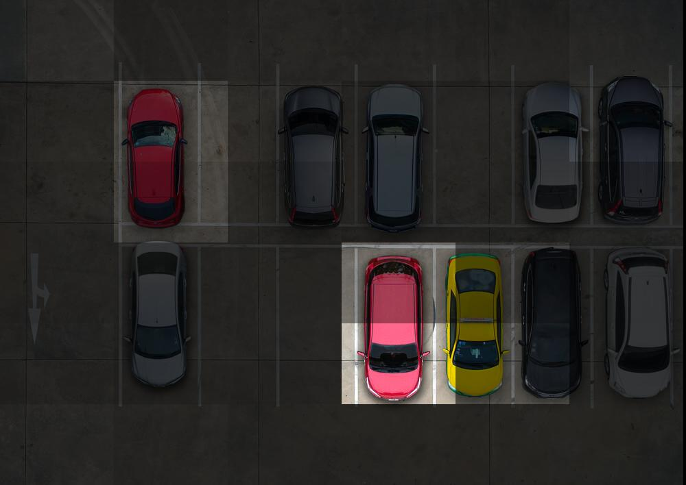
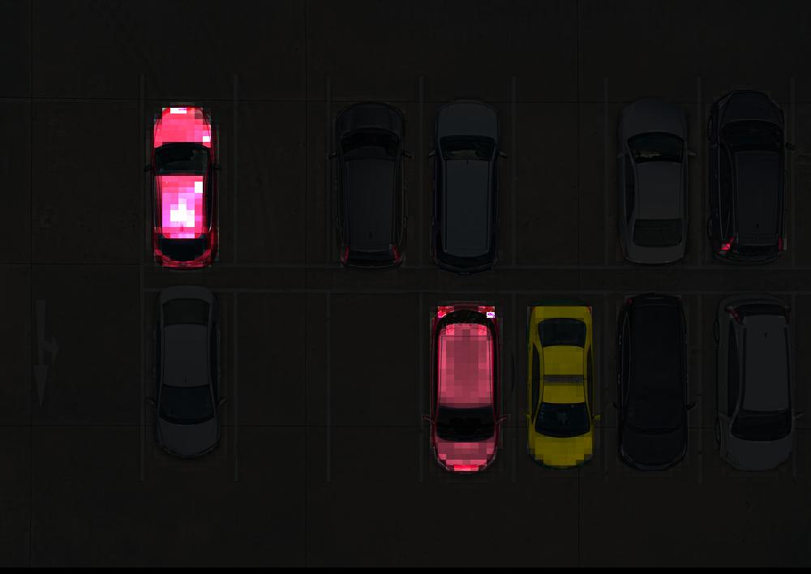
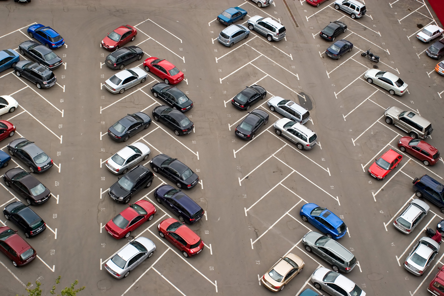
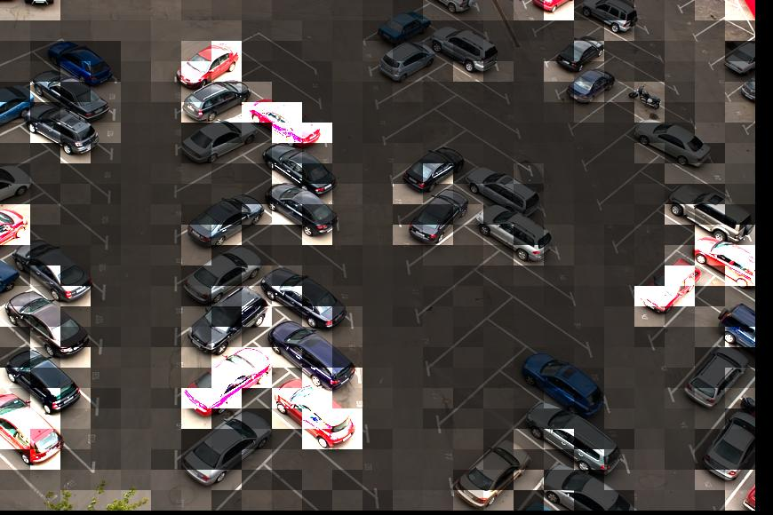
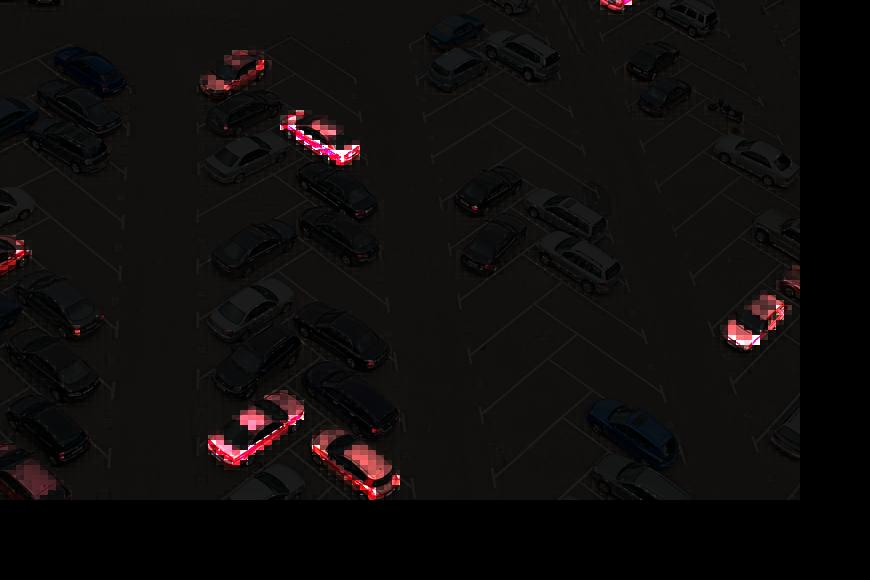

# Find-the-red-car 
*computer-vision-color-based-search*

Special forces mobilize! Computer vision activate! Enhance! 

In this exercise I use the python imaging library to locate red cars from aerial images of parking lots. To understand the surveillance state...you must become the surveillance state! Wait, that can't be right...

<iframe width="100%" src="https://www.youtube.com/embed/LGyyDVzkbr4" frameborder="0" allow="accelerometer; autoplay; encrypted-media; gyroscope; picture-in-picture" allowfullscreen></iframe>

## Setup
Install `python3` for your distribution.
```
$ sudo apt install python3
```
Install required python imaging library.
```
$ pip install pillow --upgrade
```

## Usage
The script is run from command line in the form:
```
$ python main.py /path/to/img.jpg x_grid y_grid
``` 
For example, to process `back-parking.jpg` with a `5x5` grid run: 
```
$ python main.py back-parking.jpg 5 5
```  
Images of each tile are written to `./tiles` . Each tile is a `.jpg` named in the pattern `rank.coordinates.score.jpg`. Where `rank` is the tile rank, from `0` = most-red and `n` = least-red. `coordinates` are coordinates of the tile within the original photo. `score` is a score indicating the amount of red present.

## Explanation

### 0. The goal
The task given was to break the provided image into an `nxn` grid of tiles - then calculate the amount of the color red present in each tile.

The provided photo was of a parking lot with several red cars.

### 1. Creating tiles
The original image is broken into a grid of tiles. For example, `5x5`  `8x3`  `10x6` etc. Each tile has the same dimensions, determined by `width x height` of the original image.

Each tile is described by two coordinates...

`a` is the upper-left

`b` is the bottom-right

```
a  _______
  |       |
  |  tile |
  |       |
   ------- b
```

To fully describe a tile the following the coordinates of *both*  `a` and `b` within the original image.

```
(a1, a2, b1, b2)
```

```
(0 ,0 ,100 ,100)
```

### 2. Scoring tiles

For each tile in the original image we need to calculate the amount of *red* that appears.

The "redness" of each pixel is calculated as:

```
redness = RED - GREEN - BLUE
```

For example, take this candy-apple red color `(227,46,86)`

```
redness = 227-46-86 = 95
```

The total score indicating the amount of red in the tile is the sum of the "redness" of each pixel. Tiles with much red will score higher, tiles without red will score lower.

The tiles are then ranked by their score. The `0`th tile contains the MOST red and `n`th tile contains the LEAST red.

### 3. Analyzing results

Sifting through the ranked tiles - the program certainly *seems* to be identifying tiles by amount of red. However, to better communicate this the concept of *focusing* one last image is created.

Each tile is darkened/brightened by its `rank`. The tiles are then re-assembled into a final image showing visually how the program focuses on red areas of the image.


#### Original Image


#### Focused Image, coarse-grid



#### Focused Image, fine-grid



#### Another Image



#### Another Image, coarse-grid



#### Another Image, fine-grid


